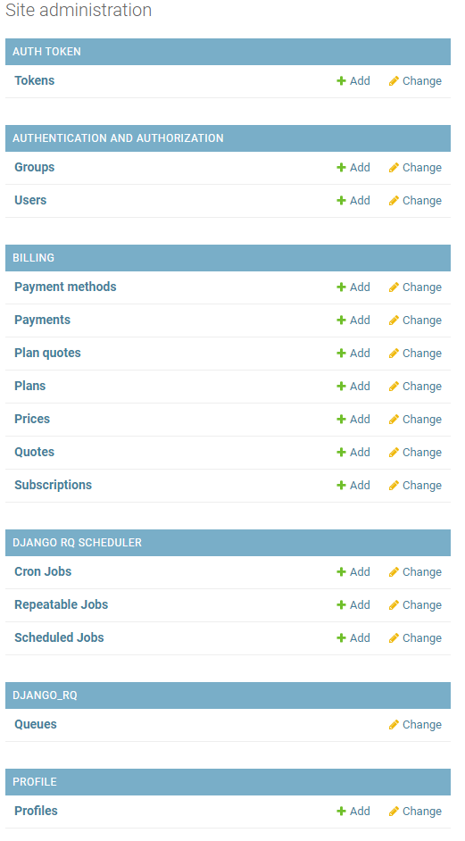

# 2.Описание панели

Панель администрирования состоит из сгруппированных строк, каждая из которых отвечает за свои функции администрирования.

| **Заголовок** | **Описание** |
| --- | --- |
| [**Tokens**](https://api.zarbo.tech/admin/authtoken/tokenproxy/) | - |
| [**Groups**](https://api.zarbo.tech/admin/auth/group/) | - |
| [**Users**](https://api.zarbo.tech/admin/auth/user/) | Список пользователей системы |
| [**Payment methods**](https://api.zarbo.tech/admin/billing/paymentmethod/) | - |
| [**Payments**](https://api.zarbo.tech/admin/billing/payment/) | - |
| [**Plan quotes**](https://api.zarbo.tech/admin/billing/planquote/) | Список квот каждого тарифа |
| [**Plans**](https://api.zarbo.tech/admin/billing/plan/) | Список тарифных планов |
| [**Prices**](https://api.zarbo.tech/admin/billing/price/) | Список прайсов |
| [**Quotes**](https://api.zarbo.tech/admin/billing/quote/) | Список всех квот |
| [**Subscriptions**](https://api.zarbo.tech/admin/billing/subscription/) | Список компаний в системе с их тарифами и возможностями |
| [**Cron Jobs**](https://api.zarbo.tech/admin/scheduler/cronjob/) | - |
| [**Repeatable Jobs**](https://api.zarbo.tech/admin/scheduler/repeatablejob/) | - |
| [**Scheduled Jobs**](https://api.zarbo.tech/admin/scheduler/scheduledjob/) | - |
| [**Queues**](https://api.zarbo.tech/admin/django_rq/queue/) | - |
| [**Profiles**](https://api.zarbo.tech/admin/profile/profile/) | Список всех профилей в системе |
