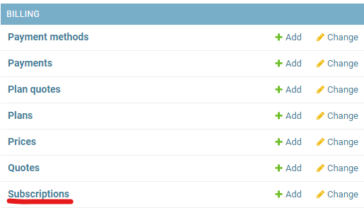
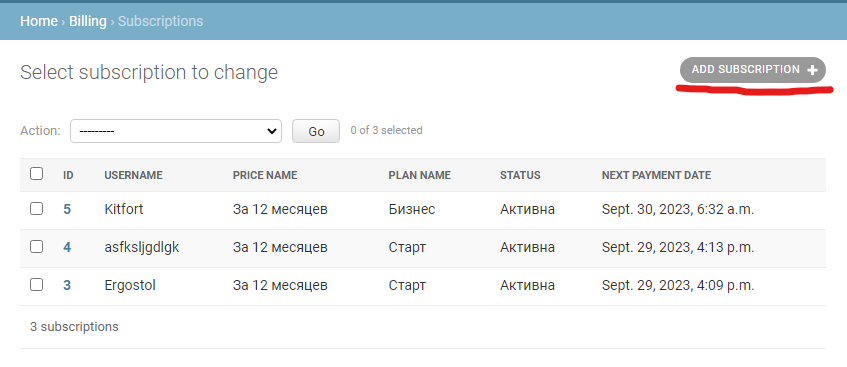
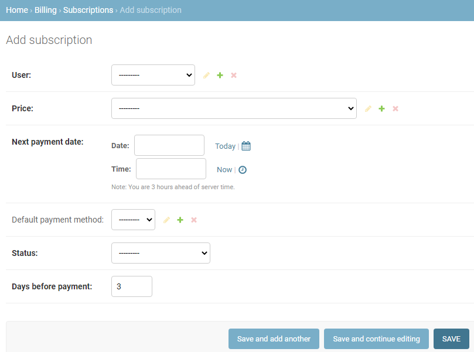
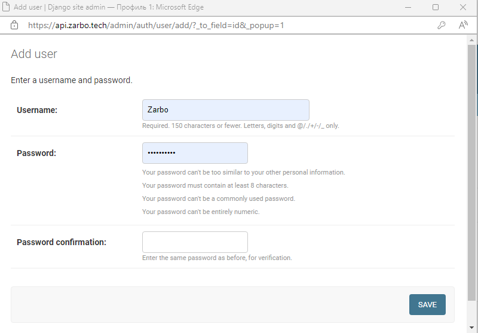
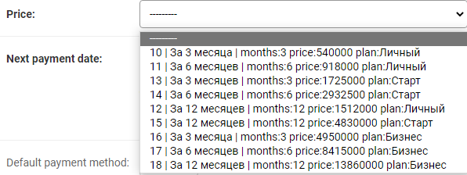
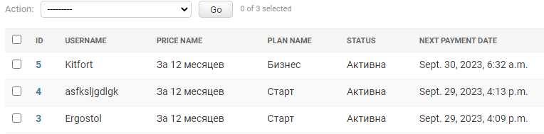

# 3. Создание нового подписчика

Для создания нового подписчика требуется нажать на поле Subscriptions.

Откроется список компаний-подписчиков системы. Чтобы добавить новую компанию, нужно нажать кнопку **add Subscription** в правом верхнем углу экрана.

При создании новой подписки требуется нажать кнопку «**+**» справа от поля user.

Открывшаяся форма создания пользователя должна быть заполнена, после чего требуется нажать save.

Поле Priсe заполняется выбором из списка доступных полей, прайс зависит от подписки нового пользователя.

Поле **status** позволяет выбрать статус оплаты.

После заполнения формы требуется нажать кнопку **SAVE**. После этого откроется страница со списком подписчиков.

