# Руководство пользователя

## Введение

Сервис **Zarbo** предназначен для визуализации в 3D и дополненной реальности объемных моделей. Zarbo позволяет организовать структурированное хранение объемных моделей, а также настраивать параметры их визуализации – специальные виджеты, которые можно встраивать на сайт или интернет-магазин.

## Список терминов

| Термин | Определение |
| --- | --- |
| **Модель** | Модель – цифровое отображение продукта, файл, который загружается в систему |
| **Продукт** | Продуктом в данной системе называется именно модель с подключёнными к ней способами представления (текстуры, расположение). |
| **Коллекция** | Коллекция – список различных продуктов, объединённых для удобства доступа. Коллекции позволяют быстро найти однотипные продукты. |
| **Виджет** | Представление продукта на сайте пользователя |

## Авторизация и регистрация

Если пользователь не имеет учетной записи в системе, ему необходимо создать учетную запись, нажав на кнопку «регистрация». Панель регистрации состоит из трёх строк: имени пользователя (логин), e-mail и пароля.

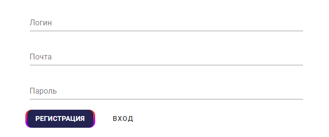

Рис 1. *Панель регистрации*

Сервис 3D визуализации Zarbo доступен в сети интернет по ссылке: [https://app.zarbo.tech](https://app.zarbo.tech/). При переходе на данную страницу пользователь попадёт в форму авторизации, в которой требуется ввести логин и пароль.

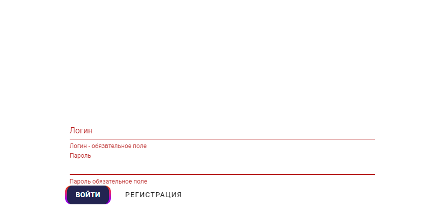

1. *Панель авторизации*

## Личный кабинет

Войти в личный кабинет можно, нажав на кнопку в правом верхнем углу экрана, после чего нажать на имя пользователя.

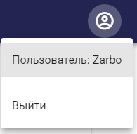

1. _Кнопка входа в личный кабинет_

В личном кабинете представлены сведения о тарифном плане, состоянии подписки и дате следующей оплаты, а также кнопка смены тарифа.

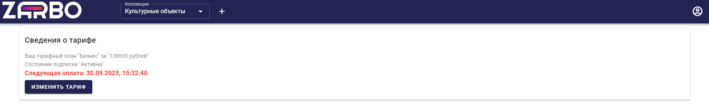

1. _Мой тариф_

# Управление продуктами

## Создание коллекции

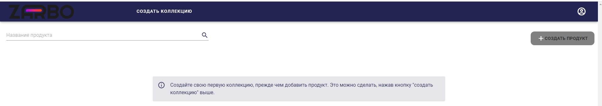

1. _Главная страница_

Для создания нового продукта сначала требуется создать коллекцию, нажав на кнопку «Создать коллекцию» вверху страницы.

Создавая новую коллекцию, требуется ввести название коллекции.

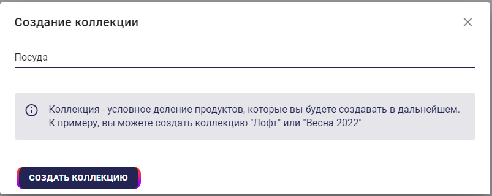

1. _Создание коллекции_

## Новый продукт

В созданной коллекции требуется нажать на кнопку «создать продукт».

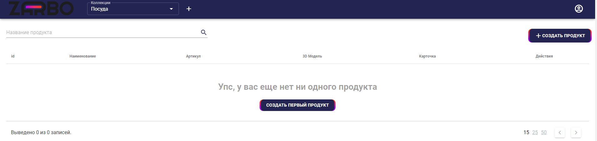

1. _Панель коллекции_

Первым шагом в создании нового продукта является ввод названия и уникального идентификатора (артикула). После их ввода требуется нажать «Далее».

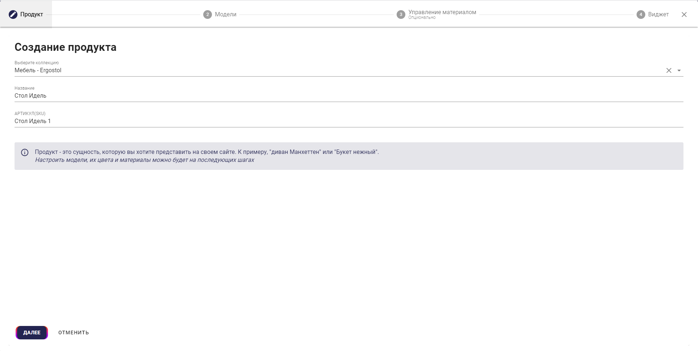

1. _Создание продукта_

## Загрузка модели

Следующий шаг – загрузка модели. Требуется нажать на поле загрузки и выбрать в открывшемся файловом проводнике необходимую модель, или перетащить значок модели в область загрузки. Система принимает четыре типа файлов с моделями продукта. Поддерживаемые форматы представлены в Таблице 1.

1. _Типы файлов моделей_

| Расширение файла | Описание |
| --- | --- |
| **Obj** | Основной тип файлов моделей, для корректного отображения требуется провести конвертацию в иные форматы |
| **Glb/Gltf** | Форматы модели, необходимые для отображения продукта на сайте и в системе Android. |
| **Usdz** | Формат модели, поддерживаемый операционной системой IOS. |
| **Fbx** | Обменный формат 3Ds Max |

Для корректного отображения модели также установлены граничные условия. При нарушении данных условий модель может отображаться некорректно или не четко:

- В одном загружаемом файле должно быть не более одной модели.
- Модель не должна быть "тяжёлой". (предел – 10000 полигонов и 25 мб).
- Развёртка текстур должна соответствовать развёртке модели, натяжений быть не должно.
- Для реалистичного отображения модели должны быть представлены минимум три карты текстур: Base color, Normal и Metallic-Roughness. В карте текстур Metallic-Roughness металлические поверхности должны быть отмечены зелёным, неметаллические – синим.

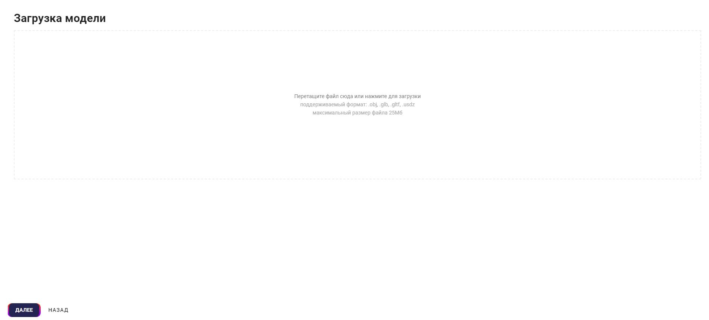

1. _Поле загрузки модели_

После загрузки модели требуется нажать на кнопку автоматической конвертации, если нет моделей всех необходимых расширений.

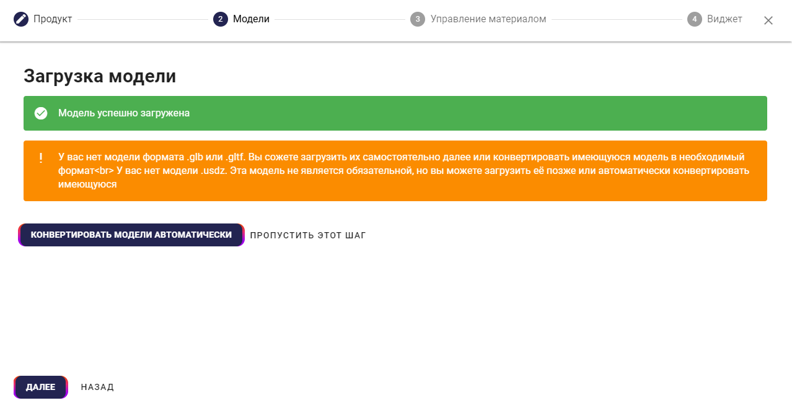

1. _Конвертация моделей_

Если предполагается демонстрация продукта на слабых платформах, после конвертации модели требуется преобразовать отображение продукта в более «легкую» форму. Для этого над окном представления модели расположена кнопка «адаптив».

**L** Это наиболее чёткая, но и наиболее массивная в плане обработки и представления модель. Отображение модели на слабых платформах может занять долгое время.

**M** Среднее качество модели. Обработка и отображение на слабых платформах займёт меньше времени, но и чёткость трёхмерного изображения будет ниже.

**S** Модель низкого качества. Малая чёткость, но отображается на любых устройствах.

По умолчанию формируется модель наиболее высокого качества. При нажатии на значок качества модели будет открыто диалоговое окно создания упрощённого представления.

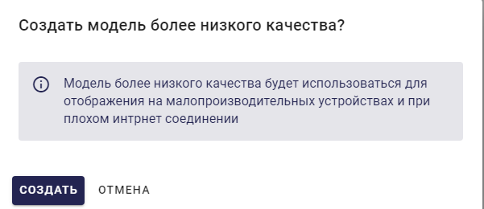

1. _Окно создания модели низкого качества_

После завершения конвертации модели пользователь может скачать результат в любом из представленных форматов, нажав на кнопку с расширением файла модели справа. Кнопка «удалить все модели» позволяет удалить все файлы модели.

1. _Форма скачивания конвертированных моделей._

## Создание текстур

Поле управления материалами позволяет загрузить необходимые текстуры на существующий объект. Для привязки текстур к модели требуется создать коллекцию текстур (материал), нажав на кнопку «создать материал» в левом-нижнем углу.

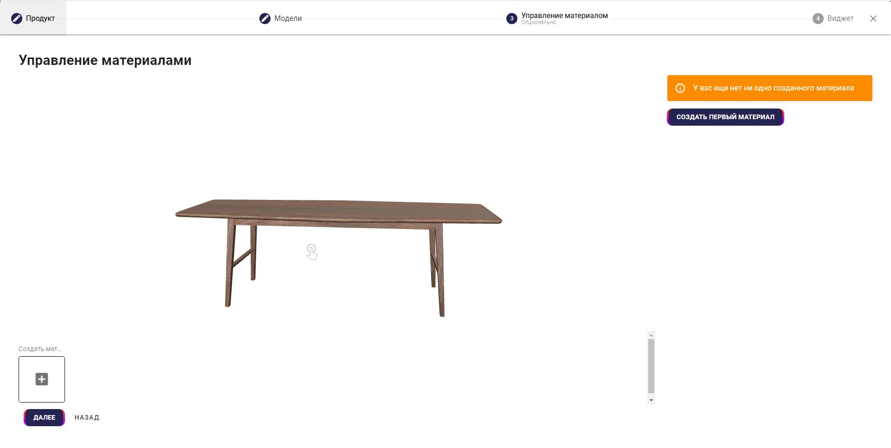

1. _Страница управления материалами_

Создание материала требует ввода названия материала, ввода кода материала (артикул каждого отдельного набора текстур, уникальный для каждого материала) и загрузки фотографии с превью необходимого узора.

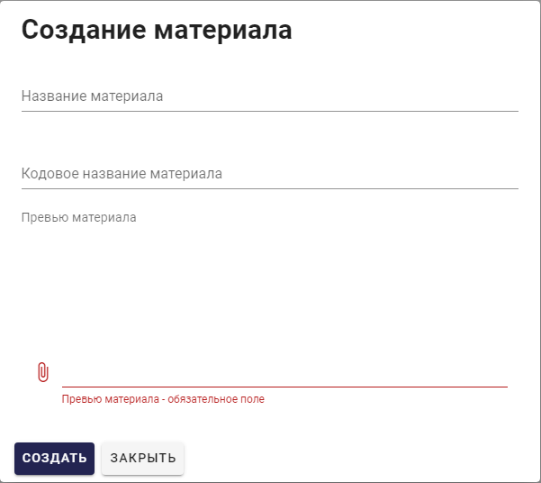

1. _Создание текстуры._

После создания набора материалов требуется в полях справа внести необходимые текстуры PBR материала в формате jpeg, чтобы применить цвета и узоры к модели. Результат применения каждого из материалов отображён в Таблице 2.

1. _Типы материалов._

| Название материала | Описание действия |
| --- | --- |
| **Base color** | Основной цвет. Цветовая гамма применяется к модели. |
| **Emission** | Излучение света, если требуется внести флуоресценцию. |
| **Metallic-Roughness** | Применение металлического отлива. Чем светлее определённая часть текстуры, тем более отражающей и «металлической» будет часть поверхности |
| **Normals** | Формирование текстурных неровностей, не отражённых на самой модели |
| **Occlusion** | Текстура теней. Позволяет сделать модель более объёмной за счёт создания теней. |

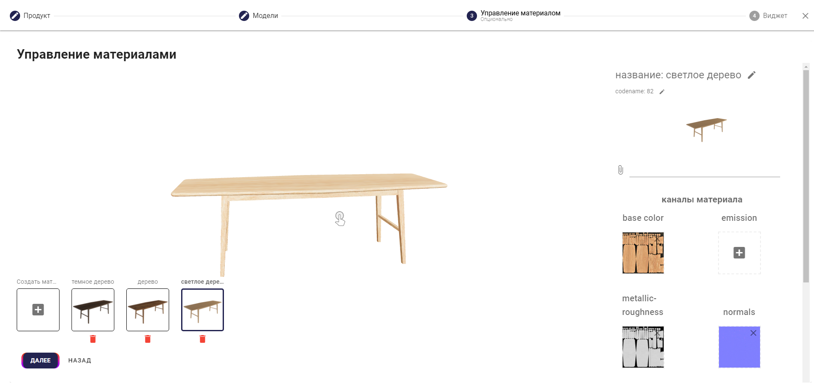

1. _Привязка текстур завершена._

Загрузив текстуры, требуется нажать кнопку «далее».

## Выбор виджетов

Поле выбора виджетов позволяет выбрать различные дополнительные возможности по управлению представлением модели. Список виджетов и результатов их применения представлен в Таблице 3.

1. _Виджеты_

| Название | Описание действия |
| --- | --- |
| **Выбор иконки** | Позволяет загрузить собственную иконку в правом нижнем углу виджета |
| **Установка материала по умолчанию** | При наличии нескольких материалов позволяет выбрать тот, который будет всегда демонстрироваться первым |
| **Превью модели** | Позволяет включить файл – заставку перед демонстрацией модели. |
| **Дополненная реальность** | Даёт возможность представить продукт в дополненной реальности. |
| **Изменение размера в дополненной реальности** | Позволяет изменять размер модели в дополненной реальности в том случае, если требуется уменьшить или увеличить продукт в AR представлении |
| **Управление камерой** | Позволяет крутить камеру вокруг продукта |
| **Логотип Зарбо** | Позволяет удалить или поставить полный логотип Зарбо в виджете. |
| **Отключить увеличение модели при обычном просмотре** | Запрещает приближение или удаление продукта при просмотре в окне |
| **Изменение материала** | Включение позволяет выбрать материал продукта, если их несколько |
| **Положение модели** | Позволяет выбрать место расположения продукта: вертикальные или горизонтальные поверхности. |

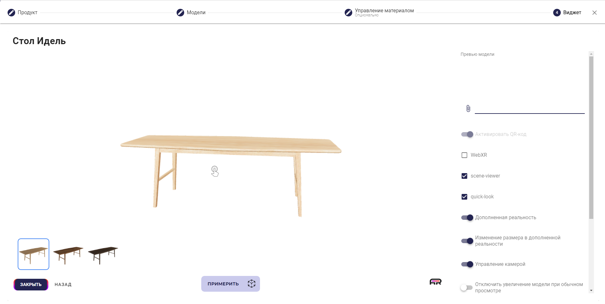

1. _Панель выбора виджетов_

После выбора всех необходимых для просмотра модели функций, можно закрыть окно редактора, сохранение выполнится автоматически.

## Настройка AR представления

Система "Зарбо" предполагает использование трёх методов представления продуктов в AR пространстве.

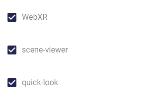

1. _Выбор представления_

1. _Типы представления_

| Наименование | Описание |
| --- | --- |
| **Web XR** | Средство просмотра для системы Андроид, имеющее расширенный функционал |
| **Scene viewer** | Более распространённое и поддерживаемое на большем числе устройств средство просмотра Андроид с ограниченным функционалом |
| **Quick look** | Средство просмотра для iOS |

## Копирование продукта

Чтобы создать копию продукта в открытой коллекции, требуется нажать кнопку «  ». Копия появится без виджетов и материалов.

## Удаление продукта

В коллекции продуктов напротив каждого продукта расположена кнопка «  ». Эта кнопка позволяет удалить уже созданный продукт. При нажатии на кнопку откроется окно подтверждения выбора, в котором требуется нажать кнопку «удалить».

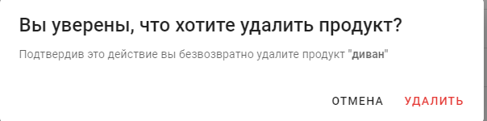

1. _Удаление продукта._

# Просмотр объектов

Каждая отдельная коллекция продуктов содержит несколько трёхмерных изображений, загруженных в коллекцию. Посмотреть их можно из меню коллекции, нажав на кнопку « 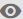 ».

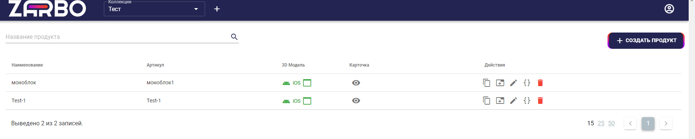

1. _Список моделей._

В появившемся окне просмотра можно манипулировать моделью: поворачивать, приближать, отдалять. Также предусмотрена кнопка для перехода в AR представление при помощи смартфона.

1. _Окно просмотра_

Нажав на кнопку и отсканировав QR код, можно примерить модель в AR представлении.

1. _Кнопка перехода в AR представление._

Для того, чтобы открыть созданный продукт и скопировать ссылку на него, требуется нажать на кнопку «  », которая продемонстрирует виджет продукта на отдельной вкладке.

# Интеграция с сайтом

Для размещения на внешнем сайте или интернет-магазине виджета 3D визуализации достаточно поместить на страницу интеграционный код - ссылку на iframe, получить которую можно по клику на кнопку «{}» в таблице продуктов:

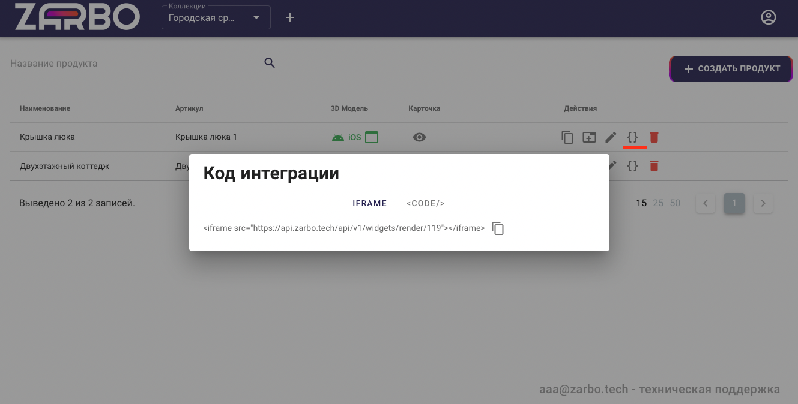

1. _Код интеграции_