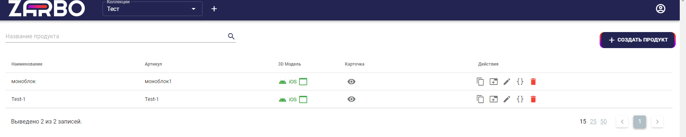

# 5. Просмотр объектов

Каждая отдельная коллекция продуктов содержит несколько трёхмерных изображений, загруженных в коллекцию. Посмотреть их можно из меню коллекции, нажав на кнопку «  ».

`Рис 19. Список моделей.`

В появившемся окне просмотра можно манипулировать моделью: поворачивать, приближать, отдалять. Также предусмотрена кнопка для перехода в AR представление при помощи смартфона.

`Рис 20. Окно просмотра`

Нажав на кнопку и отсканировав QR код, можно примерить модель в AR представлении.

`Рис 21. Кнопка перехода в AR представление.`

Для того, чтобы открыть созданный продукт и скопировать ссылку на него, требуется нажать на кнопку «  », которая продемонстрирует виджет продукта на отдельной вкладке.