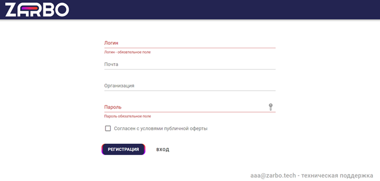
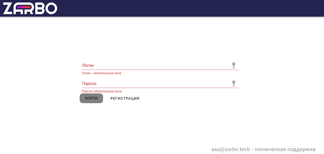

# 3. Авторизация и регистрация

Сервис Zarbo доступен по ссылке <https://app.zarbo.tech>. Нажмите на ссылку, и вы перейдёте в форму авторизации.

Если у вас ещё нет учётной записи на облачной платформе Zarbo — создайте её. Для этого нужно зарегистрироваться: указать имя пользователя, почту и название организации, затем придумать пароль и поставить галочку рядом с согласием с условиями публичной оферты.

 

*Рисунок 1. Панель регистрации*

Если учётная запись создана, введите логин и пароль и нажмите на кнопку «Войти».

 

*Рисунок 2. Панель авторизации*

