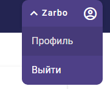
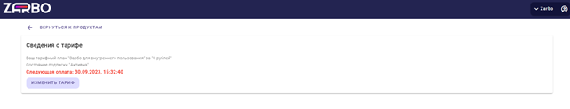

# 4. Личный кабинет

Личный кабинет пользователя содержит информацию о тарифе, состоянии подписки и дате следующей оплаты, а также кнопка смены тарифа

Войти в личный кабинет можно, нажав на кнопку в правом верхнем углу экрана, после чего требуется нажать на имя пользователя

 

*Рисунок 3. Переход в личный кабинет*

 

Здесь пользователь может получить информацию по подключённому тарифу.

 

*Рисунок 4. Личный кабинет*