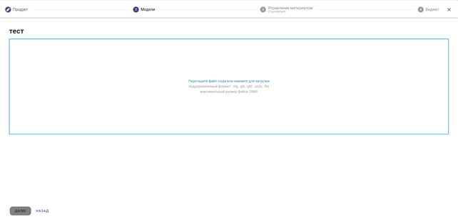

# 5. Управление продуктами

После регистрации или авторизации вы попадете в личный кабинет, где можно создавать, менять и архивировать продукты — 3D-модели с вариантами расположения и текстурами.

 

*Рисунок 3. Главная страница*

### Создание коллекции

Создание продукта начинается с создания коллекции. Нажмите на кнопку «Создать коллекцию»  в верхней правой части страницы и введите название.

Вид кнопки создать коллекцию

 

\
 

*Рисунок 4. Создание коллекции*

### Новый продукт

После создания коллекции нажмите на кнопку «Создать  продукт».

 

*Рисунок 5. Панель коллекции*

Чтобы создать новый продукт, введите название и артикул вашего товара. Убедитесь, что все данные указаны верно, и нажмите на кнопку «Далее».

 

*Рисунок 6. Создание продукта*

### Загрузка модели

Чтобы добавить модель на платформу, нажмите на поле загрузки. Откроется файловый проводник, в котором следует выбрать необходимую модель. Также можно перетащить значок модели в область загрузки.

Вы можете загрузить 4 формата файлов с моделями продукта. Их характеристики указаны в таблице 1.

| **Расширение файла** | **Описание** |
|----|----|
| Obj | Основной тип файлов моделей. Чтобы изображение корректно отображалось, его нужно конвертировать в другие форматы |
| Glb/Gltf | Формат для отображения модели на сайте и в операционной системе Android |
| Usdz | Формат для отображения в операционной системе IOS |
| Fbx | Обменный формат 3Ds Max |

*Таблица 1. Типы файлов моделей*

Чтобы модели корректно отображались, на сервисе Zarbo установлены граничные условия. Если нарушено одно или несколько условий — модель будет отображаться нечётко:

●     в одном загружаемом файле должно быть не больше одной модели;

●     модель не должна быть «тяжёлой» — максимально 10 000 полигонов и 25 мб;

●     развёртка текстур должна соответствовать развёртке моделей, также не должно быть натяжений;

●     чтобы модели смотрелись реалистично, должны быть представлены как минимум три карты текстур: Base color, Normal и Metallic-Roughness. При этом в карте текстур Metallic-Roughness металлические поверхности отмечаются зелёным, а неметаллические — синим.

 

*Рисунок 7. Поле загрузки модели*

Если на модели нет всех необходимых разрешений — после загрузки нажмите на кнопку автоматической конвертации.

 

*Рисунок 8. Конвертация моделей*

Иногда после конвертации  модели отображение продукта нужно преобразовать в более «лёгкую» форму. Например, это необходимо, если модель будет демонстрироваться на слабых платформах. Для таких случаев над окном представления модели расположена кнопка «адаптив».

Предусмотрены три варианта моделей.

L. Высокое качество. Максимально чёткая, но и наиболее массивная в плане обработки и представления модель. На слабых платформах она будет долго загружаться и отображаться некорректно.

M. Среднее качество. Отображение на слабых платформах займёт чуть меньше времени, но и качество 3D-модели будет ниже.

S. Низкое качество. Отображение на любых устройствах, но изображение нечёткое.

В сервисе Zarbo по умолчанию формируются модели максимально высокого качества. Чтобы создать упрощённое представление, нажмите на значок качества модели. Откроется диалоговое окно, в котором вы сможете выбрать подходящий вариант.

 

*Рисунок 9. Окно создания упрощённой модели*

Когда конвертация завершится, вы сможете скачать модель в любом из представленных форматов. Для этого нажмите на кнопку с расширением файла модели в правой части экрана. Чтобы удалить все файлы, нажмите на кнопку «Удалить все модели».

 

*Рисунок 10. Форма скачивания конвертированных моделей*

### Создание текстур

Текстура — изображение, которое накладывается на модель. С её помощью можно показать цвет и свойство материала, из которого изготовлен реальный товар. Так посетители вашего сайта смогут лучше понять особенности товара и принять более объективное решение о покупке.

Загрузить текстуры на модель можно в поле управления материалами. Чтобы привязать текстуры к модели, создайте коллекцию текстур (материал) — для этого нажмите на кнопку «Создать материал» в левом углу экрана.

 

*Рисунок 11. Страница управления материалами*

Вы можете самостоятельно создать материал. Для этого:

●     введите название материала;

●     введите код материала — уникальный артикул каждого отдельного набора текстур;

●     загрузите фотографию с превью необходимого вам узора.

 

*Рисунок 12. Создание текстуры*

После создания наборов материалов внесите необходимые структуры материала PBR в формате jpeg в полях справа — так вы сможете применить к модели узоры и цвета. В таблице два приведены результаты использования каждого из материалов.

| **Название материала** | **Описание действия** |
|----|----|
| Base color | Основной цвет. Цветовая гамма применяется к модели |
| Emission | Излучение цвета. Применяется, когда нужно внести флуоресценцию |
| Metallic-Roughness | Металлический отлив. Чем светлее отдельная часть текстуры, тем более отражающей и «металлической» будет часть поверхности |
| Normals | Формирование текстурных неровностей, которые не отражаются на самой модели |
| Occlusion | Текстура теней. Позволяет сделать модели более объёмными за счёт создания теней |

 

*Рисунок 13. Завершение привязки текстур*

После загрузки текстур нажмите кнопку «Далее». Теперь можно переходить к следующему шагу.

### Выбор виджетов

В поле выбора виджетов вы можете выбрать дополнительные возможности и настроить представление моделей по своему желанию. В таблице 3 мы собрали список виджетов и их описание.

| **Виджет** | **Описание действия** |
|----|----|
| Выбор иконки | Позволяет выбрать или загрузить иконку, которая будет отображаться в правом нижнем углу экрана |
| Выбор материала по умолчанию | Позволяет выбрать расцветку товара, которая будет демонстрироваться первой |
| Превью модели | Включает файл-заставку, то есть картинку, которую видит пользователь перед тем, как загрузится модель |
| Дополненная реальность | Даёт возможность представить продукт в дополненной реальности |
| Изменение размера в дополненной реальности | Меняет размер модели, когда нужно увеличить или уменьшить продукт в AR-представлении |
| Управление камерой | С его помощью можно поворачивать камеру вокруг продукта |
| Отключить увеличение модели при обычном просмотре | Запрещает приближать или удалять продукт при просмотре в окне |
| Логотип Зарбо | Позволяет установить или удалить логотип Зарбо в верхней части виджета. |
| Изменение материала | Позволяет выбрать материал продукта, если их несколько |
| Положение модели | Позволяет располагать продукт на вертикальных или горизонтальных поверхностях |

 

*Рисунок 14. Панель выбора виджетов*

Все настройки сохраняются автоматически, поэтому после выбора необходимых для просмотра функций окно редактирования можно просто закрыть.

### Настройка AR-представления

В сервисе Zarbo вам доступны три метода представления продуктов в AR-пространстве. Все они подробно описаны в таблице 4.

| **Название** | **Описание** |
|----|----|
| Web XR | Представление для просмотра моделей в системе Android с расширенным функционалом |
| Scene viewer | Более распространённый вариант, который поддерживается на большинстве устройств, средство просмотра Android, но с ограниченным функционалом |
| Quick look | Средство просмотра для iOS |

 

*Рисунок 15. Выбор представления*

### Копирование продукта

В сервисе Zarbo доступна функция копирования продукта. Она может понадобиться, когда необходимо создать два продукта с одной моделью. Например, если нужен другой виджет, достаточно сделать копию модели, а не загружать её с нуля.

Чтобы создать копию продукта в открытой коллекции, нажмите кнопку

 

Копия появится без виджетов и материалов — их следует добавить вручную.

### Удаление продукта

В коллекции напротив каждого продукта расположена кнопка \n  

С её помощью вы можете удалить ненужный продукт. После того как вы нажмёте на кнопку, откроется диалоговое окно. Здесь нужно ещё раз нажать на кнопку «Удалить» и таким образом подтвердить свой выбор. Восстановить удалённый продукт нельзя: нужно снова загружать модель и добавлять материалы и текстуры.

 

*Рисунок 16. Удаление продукта*