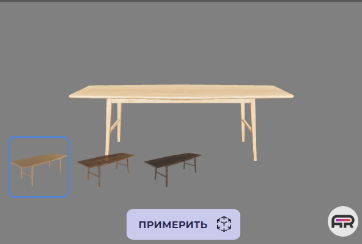

# 6. Просмотр объектов

\
В каждую коллекцию продуктов можно загружать несколько трёхмерных моделей. Вы можете посмотреть их в меню коллекции, нажав на кнопку «  ».

 

*Рисунок 17. Список моделей*

В открывшемся окне просмотра можно управлять моделью: поворачивать, приближать и отдалять. Также предусмотрена кнопка в AR-представление с телефона.

 

*Рисунок 18. Окно просмотра*

У каждой модели есть QR-код. Чтобы примерить модель в AR-представлении, нужно нажать на кнопку «Примерить» и отсканировать QR-код.

 

*Рисунок 19. Кнопка перехода в AR-представление*

Чтобы открыть созданный продукт и скопировать ссылку на него, нажмите на кнопку «  », которая продемонстрирует виджет продукта на отдельной вкладке.

