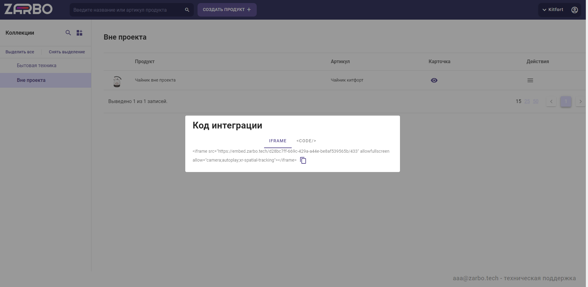

# 7. Интеграция с сайтом

Виджет 3D-визуализации вы можете разместить на своём сайте. Для этого поместите на страницу интеграционный код-ссылку на iframe. Чтобы его получить, нажмите на кнопку «{}» в таблице продуктов.

 

*Рисунок 20. Код интеграции*